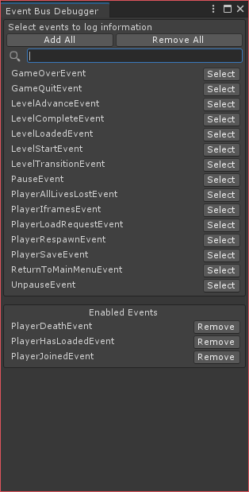
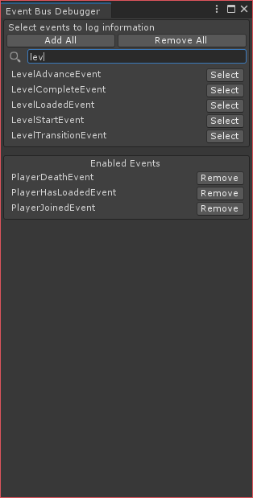

# Introduction
Welcome to my first ever official blog post! This series of posts will document my journey as a member of the WolverineSoft Studio for the 2022 winter semester. Every semester, our primary objective is to create and complete a functional and playable video game during the time span of just one semester. This semester's theme is a 2.5D beat 'em up in a cyberpunk universe, and our game will be a case study of Teenage Mutant Ninja Turtle II the video game, which was initially released in 1989.

While this is only my first semester working with the studio and second semester in college, I have had a lot of previous game development and programming experiences. A current personal project that I have been consistently working on is a physically based rendering software called [Echo](https://github.com/GaryHuan9/EchoRenderer) which is written in C# with minimal external library.

# Event Bus Rework
*5 hours (unlisted on Jira)*

## The system itself
After cloning the project repository, the first script file that I looked at is `EventBus.cs`, since it was mentioned in the project Confluence site. The original code is quite interesting, there are some Java-style variables names and comments, with other redundant or inappropriate use of the C# syntax that my IDE ([Rider](https://www.jetbrains.com/rider/)) is shouting at me with underlines. For example

```cs
IList subscriber_list = new List<Subscription<T>>(_topics[t].Cast<Subscription<T>>());
```

first uses [LINQ](https://docs.microsoft.com/en-us/dotnet/csharp/programming-guide/concepts/linq/) to cast every single element of `_topics[t]` to `Subscription<T>`, then creates a new `List<Subscription<T>>` and immediately implicitly casts it into the ancient `IList` interface. This code is inside a method that could be frequently invoked during the runtime of the game, but it allocates large area of heap memory (pressure to the GC and all that) to do what is essentially *pointless* and identical to simply doing

```cs
var subscribers = (List<Subscription<T>>)_topics[t];
```

since the list is not modified.

---

As I was scrolling through the code, I really wanted to rework and improve this `EventBus` system that we will frequently use down the line. So I messaged our project lead Nikhil, who gave me permission after he finished implementing a preliminary GUI debugger (which I later reworked as well). 

I moved methods around, changed some data structures, removed quite a lot of redundant code. I also removed the destructor for the `Subscription<T>` class, since it will *never* get invoked unless the `Subscription<T>` is explicitly unsubscribed (and destructors in C# are only designed to be used for a failsafe measure). Now, whoever invokes `Subscribe` is also fully responsible for invoking `Unsubscribe`, which makes more sense than just orphaning the `Subscription<T>`.

## The GUI debugger
Nikhil's debugger works, however it injects *a lot* of boilerplate code into the `EventBus` class itself. A great debugger should function above a system, but not entangled with the system, so I extracted all of the logging code into a different class and removed the majority of the code repetitions. While all of this reworking already used more hours than I originally expected, I still decided to also improve the graphical presentation of the debugger. 

To be able to uniquely identity all of the event contexts that can be used with `EventBus`, I added an empty `IEvent` interface which all contexts must implement. With this interface, the debugger is able to find all of the event types in our `Assembly` and list them out for our troubled user to see. 



I also added a search bar that could be very helpful in the future if we have hundreds of events. The code simply removes any candidate that does not contain the keyword that we are searching in a case-insensitive manner.



To carry the configuration of the selected events across Unity assembly reloads and editor restarts, I implemented support for binary serialization at the end as a final mini task. If there is any event selected by the user, it will create a file at the root of the project. The file will later get deleted once all events are deselected.

# Camera Controller
*6 hours*

This is the first actual task that I received. The controller itself is separated into several smaller pieces on Jira, but I was assigned (voluntarily) all of them. 

# Meetings & Logistics
*7 hours*

Although the WolverineSoft Studio weekly sunday meetings are listed as from 1100 to 1300 (yes I use military time), the meeting usually only goes for an hour as I have experienced. I am not sure whether it is because we just started the project and that there is not much to talk about, or us developers are always concise and efficient.

Anyways, since it is my first time working with the new management tools (Confluence, Jira, and Bitbucket) it took some time to know where to find stuff. I spend quite a good chunk of time just exploring in these three websites, playing around with different graphs and sliders, and reading documents written by other members. As I have basically always worked on my programming projects by myself previously, working in a team and seeing the other content produced by your peers feels amazing. Everyday there is a new feature or a new improvement added, the project is constantly changing and evolving; it is dynamic. Nonetheless, figuring stuff out or just chatting with your team in Discord is also quite time consuming.

I have never been good or fast at writing (actual words, not code) before, so writing this blog post took a while. But the informal tone does allow me to speed things up quite a bit by not having to constantly worry about grammar and word choice. Additionally, actually start using Jekyll with GitHub Pages after the setup was all complete took some extra time as well. I have never extensively written in the Markdown language before, and learning as I write was an interesting experience. The language itself is also pretty cool; I will try to embed more features in the future.

# Final Thoughts
First week has been great! I think I wrote too much in this post.